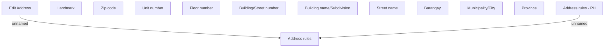

# Edit Address - PH

```mermaid
graph TD
    Address_rules["Address rules"]
    Address_rules_PH["Address rules - PH"]
    Landmark["Landmark"]
    Zip_code["Zip code"]
    Unit_number["Unit number"]
    Floor_number["Floor number"]
    Building_Street_number["Building/Street number"]
    Building_name_Subdivision["Building name/Subdivision"]
    Street_name["Street name"]
    Barangay["Barangay"]
    Municipality_City["Municipality/City"]
    Province["Province"]
    Edit_Address["Edit Address"]
    Edit_Address -->|unnamed| Address_rules
    Address_rules_PH -->|unnamed| Address_rules
```
