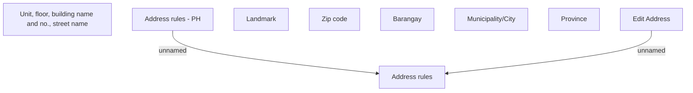

# Edit Address on AF - PH

- **Diagram Type**: Custom
- **Package**: HomerSelect/BSL/Analysis Model/COMMON for BSL/Address/User Interface/PH
- **Diagram ID**: 139551
- **Elements**: 9
- **Connectors**: 2

