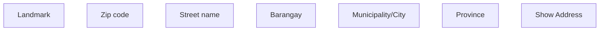

# Show Address (Application/Contract detail) - PH

- **Diagram Type**: Custom
- **Package**: HomerSelect/BSL/Analysis Model/COMMON for BSL/Address/User Interface/PH
- **Diagram ID**: 139552
- **Elements**: 7
- **Connectors**: 0

