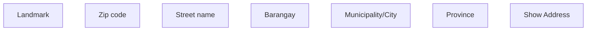

# Show Address (Application/Contract detail) - PH

```mermaid
graph TD
    Landmark["Landmark"]
    Zip_code["Zip code"]
    Street_name["Street name"]
    Barangay["Barangay"]
    Municipality_City["Municipality/City"]
    Province["Province"]
    Show_Address["Show Address"]
```
