# Show Address - PH

- **Diagram Type**: Custom
- **Package**: HomerSelect/BSL/Analysis Model/COMMON for BSL/Address/User Interface/PH
- **Diagram ID**: 139550
- **Elements**: 11
- **Connectors**: 0

```mermaid
graph TD
    Landmark["Landmark"]
    Zip_code["Zip code"]
    Unit_number["Unit number"]
    Floor_number["Floor number"]
    Building_Stree_number["Building/Stree number"]
    Building_name_Subdivision["Building name/Subdivision"]
    Street_name["Street name"]
    Barangay["Barangay"]
    Municipality_City["Municipality/City"]
    Province["Province"]
    Show_Address["Show Address"]
```

