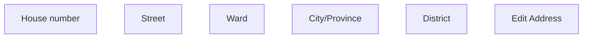

# Edit Address - VN

- **Diagram Type**: Custom
- **Package**: HomerSelect/BSL/Analysis Model/COMMON for BSL/Address/User Interface/VN
- **Diagram ID**: 132272
- **Elements**: 6
- **Connectors**: 0

