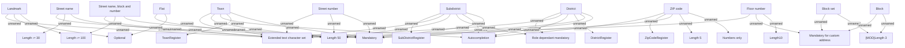

# Adress validation rules - ID

```mermaid
graph TD
    Street_name_block_and_number["Street name, block and number"]
    Length_100["Length ‹= 100"]
    Length_30["Length ‹= 30"]
    Optional["Optional"]
    Mandatory["Mandatory"]
    Length_5["Length 5"]
    Mandatory_for_custom_address["Mandatory for custom address"]
    MOD_Length_3["{MOD}Length 3"]
    Numbers_only["Numbers only"]
    Length10["Length10"]
    Extended_text_character_set["Extended text character set"]
    Length_50["Length 50"]
    Role_dependant_mandatory["Role dependant mandatory"]
    Autocompletion["Autocompletion"]
    ZipCodeRegister["ZipCodeRegister"]
    DistrictRegister["DistrictRegister"]
    Flat["Flat"]
    Town["Town"]
    Subdistrict["Subdistrict"]
    Street_number["Street number"]
    Street_name["Street name"]
    Block["Block"]
    Block_set["Block set"]
    ZIP_code["ZIP code"]
    Landmark["Landmark"]
    Floor_number["Floor number"]
    TownRegister["TownRegister"]
    SubDistrictRegister["SubDistrictRegister"]
    District["District"]
    Street_number -->|unnamed| Mandatory
    Floor_number -->|unnamed| Length10
    ZIP_code -->|unnamed| Numbers_only
    Block -->|unnamed| MOD_Length_3
    Block_set -->|unnamed| MOD_Length_3
    Block_set -->|unnamed| Mandatory_for_custom_address
    Block -->|unnamed| Mandatory_for_custom_address
    Floor_number -->|unnamed| Mandatory_for_custom_address
    ZIP_code -->|unnamed| Length_5
    Landmark -->|unnamed| Length_100
    Street_name_block_and_number -->|unnamed| Mandatory
    Street_name -->|unnamed| Extended_text_character_set
    District -->|unnamed| Mandatory
    Subdistrict -->|unnamed| Mandatory
    ZIP_code -->|unnamed| Mandatory
    Town -->|unnamed| Mandatory
    Flat -->|unnamed| Optional
    Landmark -->|unnamed| Optional
    Street_name -->|unnamed| Length_30
    Street_name_block_and_number -->|unnamed| Length_100
    Street_name -->|unnamed| Mandatory
    District -->|unnamed| Length_50
    Town -->|unnamed| TownRegister
    District -->|unnamed| DistrictRegister
    ZIP_code -->|unnamed| ZipCodeRegister
    Town -->|unnamed| Autocompletion
    ZIP_code -->|unnamed| Autocompletion
    District -->|unnamed| Autocompletion
    Subdistrict -->|unnamed| Autocompletion
    Subdistrict -->|unnamed| Role_dependant_mandatory
    Landmark -->|unnamed| Extended_text_character_set
    Flat -->|unnamed| Length_50
    Street_name_block_and_number -->|unnamed| Extended_text_character_set
    Subdistrict -->|unnamed| Length_50
    Street_number -->|unnamed| Length_50
    Town -->|unnamed| Length_50
    Street_number -->|unnamed| Extended_text_character_set
    Subdistrict -->|unnamed| Extended_text_character_set
    Town -->|unnamed| Extended_text_character_set
    Floor_number -->|unnamed| Extended_text_character_set
    District -->|unnamed| Extended_text_character_set
    Subdistrict -->|unnamed| SubDistrictRegister
    District -->|unnamed| Role_dependant_mandatory
```
