# Adress validation rules - IN

- **Diagram Type**: Custom
- **Package**: HomerSelect/BSL/Analysis Model/COMMON for BSL/Address/Validation rules/IN
- **Diagram ID**: 158198
- **Elements**: 22
- **Connectors**: 19

```mermaid
graph TD
    ADD_Length_70["{ADD} Length 70"]
    Numbers_only["Numbers only"]
    Length_50["Length 50"]
    Optional["Optional"]
    Building["Building"]
    MOD_Address_rules_IN["{MOD}Address rules - IN"]
    Length10["Length10"]
    Length40["Length40"]
    Length60["Length60"]
    Mandatory["Mandatory"]
    RegionRegister["RegionRegister"]
    Region["Region"]
    Town["Town"]
    PostOfficeRegister["PostOfficeRegister"]
    PIN_code["PIN code"]
    Landmark["Landmark"]
    Locality["Locality"]
    Street_name["Street name"]
    Floor_No["Floor No"]
    DistrictRegister["DistrictRegister"]
    District["District"]
    Cross_validation["Cross validation"]
    Locality -->|unnamed| ADD_Length_70
    Building -->|unnamed| Cross_validation
    Region -->|unnamed| Mandatory
    Region -->|unnamed| RegionRegister
    Town -->|unnamed| Mandatory
    Town -->|unnamed| ADD_Length_70
    PIN_code -->|unnamed| Mandatory
    PIN_code -->|unnamed| PostOfficeRegister
    Building -->|unnamed| ADD_Length_70
    Landmark -->|unnamed| ADD_Length_70
    District -->|unnamed| DistrictRegister
    Locality -->|unnamed| Cross_validation
    Street_name -->|unnamed| ADD_Length_70
    Street_name -->|unnamed| Cross_validation
    Floor_No -->|unnamed| Mandatory
    Floor_No -->|unnamed| Numbers_only
    Floor_No -->|unnamed| Length10
    District -->|unnamed| Mandatory
    Landmark -->|unnamed| Optional
```

