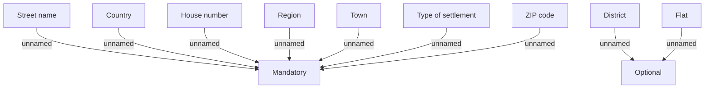

# Attributes necessity - KZ

```mermaid
graph TD
    Optional["Optional"]
    Mandatory["Mandatory"]
    ZIP_code["ZIP code"]
    Type_of_settlement["Type of settlement"]
    Town["Town"]
    Region["Region"]
    House_number["House number"]
    Flat["Flat"]
    District["District"]
    Country["Country"]
    Street_name["Street name"]
    Street_name -->|unnamed| Mandatory
    Country -->|unnamed| Mandatory
    District -->|unnamed| Optional
    Flat -->|unnamed| Optional
    House_number -->|unnamed| Mandatory
    Region -->|unnamed| Mandatory
    Town -->|unnamed| Mandatory
    Type_of_settlement -->|unnamed| Mandatory
    ZIP_code -->|unnamed| Mandatory
```
