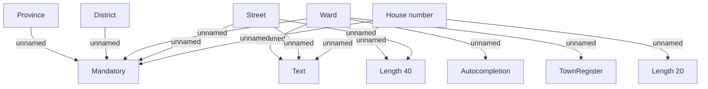

# Address validation rules - VN

- **Diagram Type**: Custom
- **Package**: HomerSelect/BSL/Analysis Model/COMMON for BSL/Address/Validation rules/VN
- **Diagram ID**: 48083
- **Elements**: 11
- **Connectors**: 13

