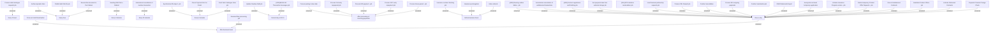

# Automatic jobs

```mermaid
graph TD
    ADD_Cleaning_outbox_tables_job["{ADD}Cleaning outbox tables - job"]
    Process_INS_outgoing_payments["Process INS outgoing payments"]
    Every_2_hours["Every 2 hours"]
    Process_debt_catalogue_requests_job["Process debt catalogue requests job"]
    ADD_Contract_registration_and_finishing_job["{ADD}Contract registration and finishing job"]
    Process_pairing_in_due_date["Process pairing in due date"]
    Archive_dynamic_links["Archive dynamic links"]
    Resend_the_document_to_the_Cabinet["Resend the document to the Cabinet"]
    ADD_BOOK_NG_Transaction_messages_job["{ADD}BOOK NG Transaction messages job"]
    Anonymize_archived_temporary_application["Anonymize archived temporary application"]
    Hide_contracts["Hide contracts"]
    Process_CEL_Reward_job["Process CEL Reward job"]
    Scanned_files_processing_job["Scanned files processing job"]
    Load_financial_partnership_requests_job["Load financial partnership requests job"]
    Every_hour["Every hour"]
    Get_prepared_data_from_external_storage_job["Get prepared data from external storage job"]
    Publish_debt_full_info_job["Publish debt full info job"]
    Synchronize_SN_object_job["Synchronize SN object - job"]
    Invalidate_Product_Offers_job["Invalidate Product Offers - job"]
    Delete_temporary_Product_Offer_Requests_job["Delete temporary Product Offer Requests - job"]
    Check_Payment_File_For_Finish["Check Payment File For Finish"]
    Activate_Insurance_Program_version_job["Activate Insurance Program version - job"]
    Process_Gift_payment_job["Process Gift payment - job"]
    Every_2_minutes["Every 2 minutes"]
    Sending_DMS_file_to_Cabinet["Sending DMS file to Cabinet"]
    Process_Grace_period_job["Process Grace period - job"]
    Every_25_minutes["Every 25 minutes"]
    Every_5_minutes["Every 5 minutes"]
    Once_a_day["Once a day"]
    Current_day_at_00_01["Current day at 00:01"]
    After_processing_of_incoming_payments["After processing of incoming payments"]
    After_business_hours["After business hours"]
    Before_business_hours["Before business hours"]
    Insurance_prolongation["Insurance prolongation"]
    DEL_DPD_statistics_recalculation_job["{DEL}DPD statistics recalculation job"]
    Process_CET_early_repayment_job["Process CET early repayment job"]
    Process_Full_early_repayment_job["Process Full early repayment job"]
    Automatical_cancellation_of_undisbursed_transactions["Automatical cancellation of undisbursed transactions"]
    Automatical_cancellation_of_inactive_transaction["Automatical cancellation of inactive transaction"]
    Contract_reactivation_job["Contract reactivation job"]
    Insurance_contract_finishing_job["Insurance contract finishing job"]
    Cancel_Undisbursed_Contracts["Cancel Undisbursed Contracts"]
    Activate_Disbursed_Contracts["Activate Disbursed Contracts"]
    Cross_sel_Limit_Deactivation["Cross-sel Limit Deactivation"]
    Push_Debt_Catalogue_Data_job["Push Debt Catalogue Data job"]
    Payment_Channel_Change_Check["Payment Channel Change Check"]
    DDM_Statements_Export["DDM Statements Export"]
    Update_Overdue_Debt_job["Update Overdue Debt job"]
    Contract_cancellation["Contract cancellation"]
    Synchronize_SN_object_job -->|unnamed| Every_5_minutes
    Process_debt_catalogue_requests_job -->|unnamed| Every_2_hours
    ADD_Cleaning_outbox_tables_job -->|unnamed| Once_a_day
    Automatical_cancellation_of_undisbursed_transactions -->|unnamed| Once_a_day
    ADD_Contract_registration_and_finishing_job -->|unnamed| Once_a_day
    Get_prepared_data_from_external_storage_job -->|unnamed| Once_a_day
    Load_financial_partnership_requests_job -->|unnamed| Once_a_day
    Process_CEL_Reward_job -->|unnamed| Once_a_day
    Contract_cancellation -->|unnamed| Once_a_day
    Process_INS_outgoing_payments -->|unnamed| Once_a_day
    DDM_Statements_Export -->|unnamed| Once_a_day
    Check_Payment_File_For_Finish -->|unnamed| Every_5_minutes
    Push_Debt_Catalogue_Data_job -->|unnamed| Every_5_minutes
    Automatical_cancellation_of_inactive_transaction -->|unnamed| Every_25_minutes
    Sending_DMS_file_to_Cabinet -->|unnamed| Every_2_minutes
    Archive_dynamic_links -->|unnamed| Every_hour
    Publish_debt_full_info_job -->|unnamed| Every_hour
    Resend_the_document_to_the_Cabinet -->|unnamed| Every_hour
    Anonymize_archived_temporary_application -->|unnamed| Once_a_day
    Process_pairing_in_due_date -->|unnamed| After_processing_of_incoming_payments
    Insurance_contract_finishing_job -->|unnamed| Before_business_hours
    Insurance_prolongation -->|unnamed| Before_business_hours
    Cross_sel_Limit_Deactivation -->|unnamed| After_business_hours
    Scanned_files_processing_job -->|unnamed| After_business_hours
    Once_a_day -->|unnamed| After_business_hours
    Process_Full_early_repayment_job -->|unnamed| After_processing_of_incoming_payments
    Process_Gift_payment_job -->|unnamed| After_processing_of_incoming_payments
    Activate_Insurance_Program_version_job -->|unnamed| Once_a_day
    Process_CET_early_repayment_job -->|unnamed| After_processing_of_incoming_payments
    Hide_contracts -->|unnamed| Before_business_hours
    Update_Overdue_Debt_job -->|unnamed| Current_day_at_00_01
    ADD_BOOK_NG_Transaction_messages_job -->|unnamed| Current_day_at_00_01
    Delete_temporary_Product_Offer_Requests_job -->|unnamed| Once_a_day
    Cancel_Undisbursed_Contracts -->|unnamed| Once_a_day
    Invalidate_Product_Offers_job -->|unnamed| Once_a_day
    Activate_Disbursed_Contracts -->|unnamed| Once_a_day
    Payment_Channel_Change_Check -->|unnamed| Once_a_day
    Process_Grace_period_job -->|unnamed| After_processing_of_incoming_payments
```
