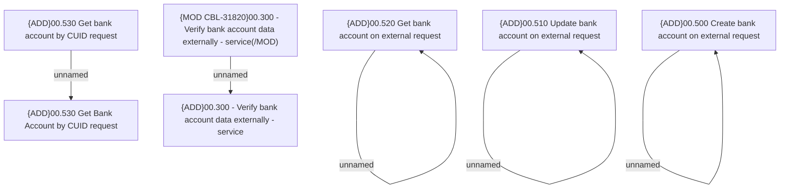

# Access Rights

```mermaid
graph TD
    ADD_00_530_Get_Bank_Account_by_CUID_request["{ADD}00.530 Get Bank Account by CUID request"]
    ADD_00_530_Get_bank_account_by_CUID_request["{ADD}00.530 Get bank account by CUID request"]
    ADD_00_520_Get_bank_account_on_external_request["{ADD}00.520 Get bank account on external request"]
    ADD_00_510_Update_bank_account_on_external_request["{ADD}00.510 Update bank account on external request"]
    ADD_00_520_Get_bank_account_on_external_request["{ADD}00.520 Get bank account on external request"]
    ADD_00_510_Update_bank_account_on_external_request["{ADD}00.510 Update bank account on external request"]
    ADD_00_500_Create_bank_account_on_external_request["{ADD}00.500 Create bank account on external request"]
    ADD_00_500_Create_bank_account_on_external_request["{ADD}00.500 Create bank account on external request"]
    ADD_00_300_Verify_bank_account_data_externally_service["{ADD}00.300 - Verify bank account data externally - service"]
    MOD_CBL_31820_00_300_Verify_bank_account_data_externally_ser["{MOD CBL-31820}00.300 - Verify bank account data externally - service(/MOD)"]
    ADD_00_510_Update_bank_account_on_external_request -->|unnamed| ADD_00_510_Update_bank_account_on_external_request
    ADD_00_530_Get_bank_account_by_CUID_request -->|unnamed| ADD_00_530_Get_Bank_Account_by_CUID_request
    ADD_00_500_Create_bank_account_on_external_request -->|unnamed| ADD_00_500_Create_bank_account_on_external_request
    ADD_00_520_Get_bank_account_on_external_request -->|unnamed| ADD_00_520_Get_bank_account_on_external_request
    MOD_CBL_31820_00_300_Verify_bank_account_data_externally_ser -->|unnamed| ADD_00_300_Verify_bank_account_data_externally_service
```
