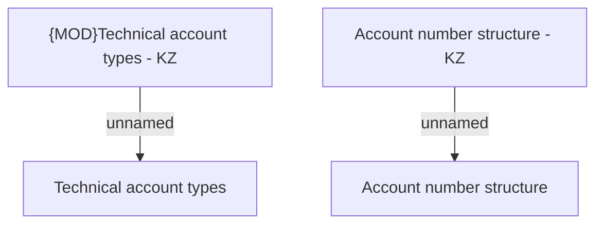

# Business rules

- **Diagram Type**: Custom
- **Package**: HomerSelect/BSL/Analysis Model/COMMON for BSL/Bank Account Management/Business rules
- **Diagram ID**: 109372
- **Elements**: 4
- **Connectors**: 2

