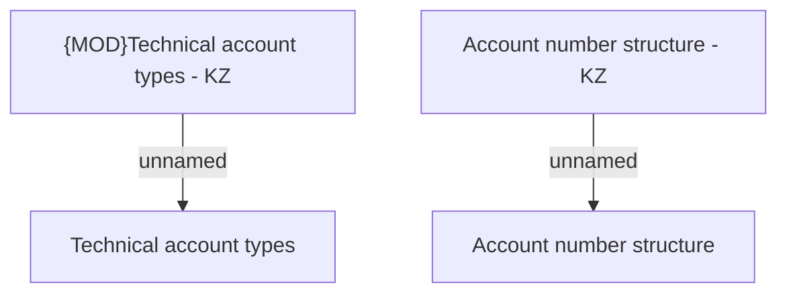

# Business rules

```mermaid
graph TD
    Technical_account_types["Technical account types"]
    MOD_Technical_account_types_KZ["{MOD}Technical account types - KZ"]
    Account_number_structure_KZ["Account number structure - KZ"]
    Account_number_structure["Account number structure"]
    Account_number_structure_KZ -->|unnamed| Account_number_structure
    MOD_Technical_account_types_KZ -->|unnamed| Technical_account_types
```
