# Edit Bank Account

- **Diagram Type**: Custom
- **Package**: HomerSelect/BSL/Analysis Model/COMMON for BSL/Bank Account Management/User interface
- **Diagram ID**: 140198
- **Elements**: 14
- **Connectors**: 0

```mermaid
graph TD
    Create_Update_bank_account_for_consolidation_KZ["Create/Update bank account for consolidation - KZ"]
    el_1644342["Text"]
    el_1644336["Text"]
    el_1644346["Text"]
    el_1644347["Text"]
    el_1644343["Text"]
    Create_Update_bank_account_for_DD_ID["Create/Update bank account for DD - ID"]
    Create_Update_bank_account_for_disbursement_ID["Create/Update bank account for disbursement - ID"]
    Create_Update_bank_account_PH["Create/Update bank account - PH"]
    Create_Update_bank_acount_KZ["Create/Update bank acount - KZ"]
    Create_update_bank_account_in_AF_VN["Create/update bank account in AF - VN"]
    Create_update_bank_account_VN["Create/update bank account - VN"]
    Create_Update_bank_acount_IN["Create/Update bank acount - IN"]
    Create_Update_bank_acount_ID["Create/Update bank acount - ID"]
```

