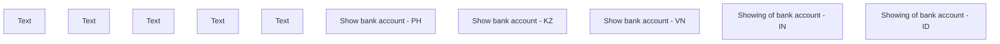

# Show Bank Account

- **Diagram Type**: Custom
- **Package**: HomerSelect/BSL/Analysis Model/COMMON for BSL/Bank Account Management/User interface
- **Diagram ID**: 140199
- **Elements**: 10
- **Connectors**: 0

