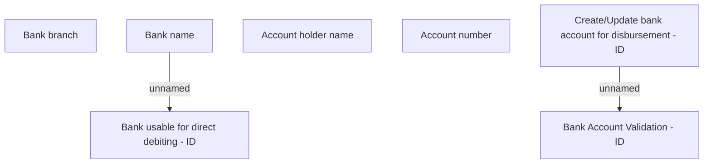

# Create/Update bank account for DD - ID

```mermaid
graph TD
    Bank_usable_for_direct_debiting_ID["Bank usable for direct debiting - ID"]
    Bank_Account_Validation_ID["Bank Account Validation - ID"]
    Bank_branch["Bank branch"]
    Bank_name["Bank name"]
    Account_holder_name["Account holder name"]
    Account_number["Account number"]
    Create_Update_bank_account_for_disbursement_ID["Create/Update bank account for disbursement - ID"]
    Create_Update_bank_account_for_disbursement_ID -->|unnamed| Bank_Account_Validation_ID
    Bank_name -->|unnamed| Bank_usable_for_direct_debiting_ID
```
