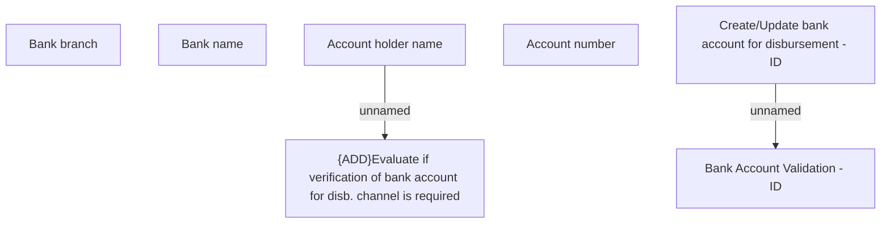

# Create/Update bank account for disbursement - ID

```mermaid
graph TD
    Bank_Account_Validation_ID["Bank Account Validation - ID"]
    ADD_Evaluate_if_verification_of_bank_account_for_disb_channe["{ADD}Evaluate if verification of bank account for disb. channel is required"]
    Bank_branch["Bank branch"]
    Bank_name["Bank name"]
    Account_holder_name["Account holder name"]
    Account_number["Account number"]
    Create_Update_bank_account_for_disbursement_ID["Create/Update bank account for disbursement - ID"]
    Account_holder_name -->|unnamed| ADD_Evaluate_if_verification_of_bank_account_for_disb_channe
    Create_Update_bank_account_for_disbursement_ID -->|unnamed| Bank_Account_Validation_ID
```
