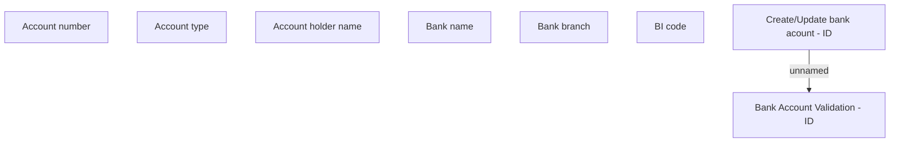

# Create/Update bank acount - ID

- **Diagram Type**: Custom
- **Package**: HomerSelect/BSL/Analysis Model/COMMON for BSL/Bank Account Management/User interface/ID
- **Diagram ID**: 151023
- **Elements**: 8
- **Connectors**: 1

