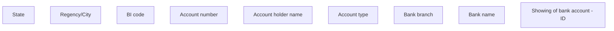

# Show bank account - ID

```mermaid
graph TD
    State["State"]
    Regency_City["Regency/City"]
    BI_code["BI code"]
    Account_number["Account number"]
    Account_holder_name["Account holder name"]
    Account_type["Account type"]
    Bank_branch["Bank branch"]
    Bank_name["Bank name"]
    Showing_of_bank_account_ID["Showing of bank account - ID"]
```
