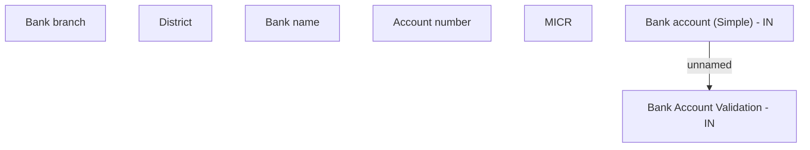

# Bank accont (Simple) - IN

- **Diagram Type**: Custom
- **Package**: HomerSelect/BSL/Analysis Model/COMMON for BSL/Bank Account Management/User interface/IN
- **Diagram ID**: 151016
- **Elements**: 7
- **Connectors**: 1

