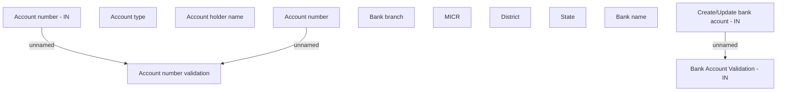

# Create/Update bank acount - IN

```mermaid
graph TD
    Account_number_IN["Account number - IN"]
    Account_number_validation["Account number validation"]
    Account_type["Account type"]
    Account_holder_name["Account holder name"]
    Bank_Account_Validation_IN["Bank Account Validation - IN"]
    Account_number["Account number"]
    Bank_branch["Bank branch"]
    MICR["MICR"]
    District["District"]
    State["State"]
    Bank_name["Bank name"]
    Create_Update_bank_acount_IN["Create/Update bank acount - IN"]
    Create_Update_bank_acount_IN -->|unnamed| Bank_Account_Validation_IN
    Account_number_IN -->|unnamed| Account_number_validation
    Account_number -->|unnamed| Account_number_validation
```
