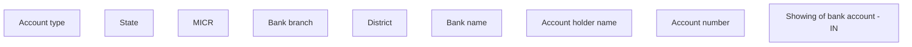

# Show bank account - IN

- **Diagram Type**: Custom
- **Package**: HomerSelect/BSL/Analysis Model/COMMON for BSL/Bank Account Management/User interface/IN
- **Diagram ID**: 151015
- **Elements**: 9
- **Connectors**: 0

