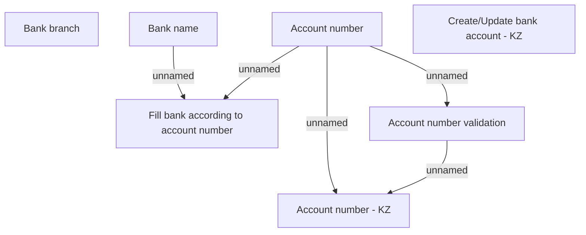

# Create/Update bank account - KZ

```mermaid
graph TD
    Fill_bank_according_to_account_number["Fill bank according to account number"]
    Account_number_KZ["Account number - KZ"]
    Account_number_validation["Account number validation"]
    Bank_branch["Bank branch"]
    Bank_name["Bank name"]
    Account_number["Account number"]
    Create_Update_bank_account_KZ["Create/Update bank account - KZ"]
    Account_number -->|unnamed| Account_number_validation
    Account_number -->|unnamed| Account_number_KZ
    Bank_name -->|unnamed| Fill_bank_according_to_account_number
    Account_number -->|unnamed| Fill_bank_according_to_account_number
    Account_number_validation -->|unnamed| Account_number_KZ
```
