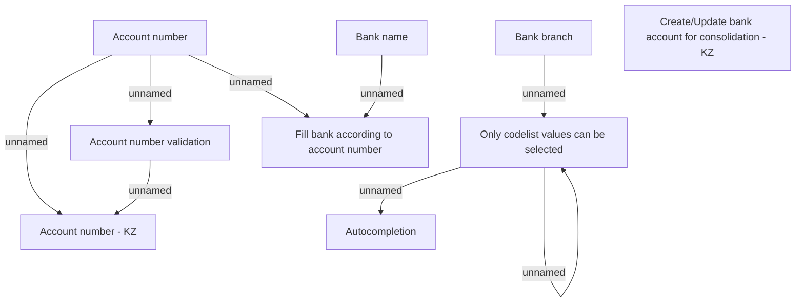

# Create/Update bank account for consolidation - KZ

- **Diagram Type**: Custom
- **Package**: HomerSelect/BSL/Analysis Model/COMMON for BSL/Bank Account Management/User interface/KZ
- **Diagram ID**: 151022
- **Elements**: 10
- **Connectors**: 8

