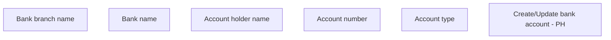

# Create/Update bank account - PH

- **Diagram Type**: Custom
- **Package**: HomerSelect/BSL/Analysis Model/COMMON for BSL/Bank Account Management/User interface/PH
- **Diagram ID**: 163923
- **Elements**: 6
- **Connectors**: 0

