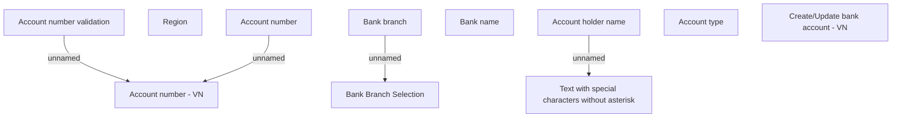

# Create/update bank account - VN

```mermaid
graph TD
    Account_number_validation["Account number validation"]
    Text_with_special_characters_without_asterisk["Text with special characters without asterisk"]
    Account_number_VN["Account number - VN"]
    Region["Region"]
    Bank_branch["Bank branch"]
    Account_holder_name["Account holder name"]
    Bank_name["Bank name"]
    Account_number["Account number"]
    Account_type["Account type"]
    Create_Update_bank_account_VN["Create/Update bank account - VN"]
    Bank_Branch_Selection["Bank Branch Selection"]
    Bank_branch -->|unnamed| Bank_Branch_Selection
    Account_number_validation -->|unnamed| Account_number_VN
    Account_number -->|unnamed| Account_number_VN
    Account_holder_name -->|unnamed| Text_with_special_characters_without_asterisk
```
