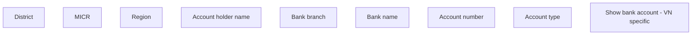

# Show bank account - VN

```mermaid
graph TD
    District["District"]
    MICR["MICR"]
    Region["Region"]
    Account_holder_name["Account holder name"]
    Bank_branch["Bank branch"]
    Bank_name["Bank name"]
    Account_number["Account number"]
    Account_type["Account type"]
    Show_bank_account_VN_specific["Show bank account - VN specific"]
```
