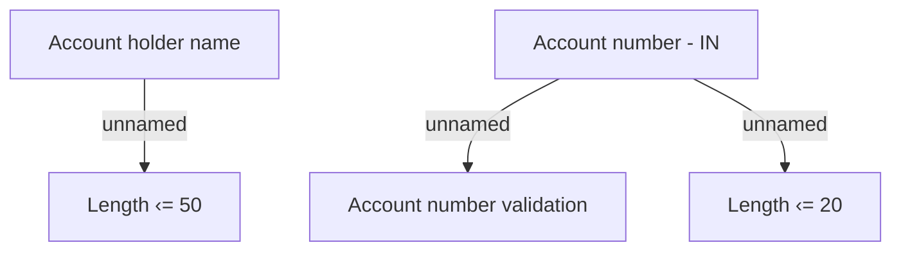

# Validation rules IN

- **Diagram Type**: Custom
- **Package**: HomerSelect/BSL/Analysis Model/COMMON for BSL/Bank Account Management/Validation rules/IN
- **Diagram ID**: 68502
- **Elements**: 5
- **Connectors**: 3

