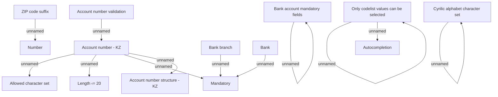

# Validation rules KZ

```mermaid
graph TD
    Account_number_validation["Account number validation"]
    Bank_account_mandatory_fields["Bank account mandatory fields"]
    Bank_account_mandatory_fields["Bank account mandatory fields"]
    Number["Number"]
    ZIP_code_suffix["ZIP code suffix"]
    Cyrilic_alphabet_character_set["Cyrilic alphabet character set"]
    Cyrilic_alphabet_character_set["Cyrilic alphabet character set"]
    Autocompletion["Autocompletion"]
    Only_codelist_values_can_be_selected["Only codelist values can be selected"]
    Only_codelist_values_can_be_selected["Only codelist values can be selected"]
    Account_number_structure_KZ["Account number structure - KZ"]
    Length_20["Length ‹= 20"]
    Allowed_character_set["Allowed character set"]
    Mandatory["Mandatory"]
    Bank_branch["Bank branch"]
    Bank["Bank"]
    Account_number_KZ["Account number - KZ"]
    Account_number_KZ -->|unnamed| Allowed_character_set
    Account_number_KZ -->|unnamed| Length_20
    Account_number_KZ -->|unnamed| Mandatory
    Account_number_KZ -->|unnamed| Account_number_structure_KZ
    Bank -->|unnamed| Mandatory
    Bank_branch -->|unnamed| Mandatory
    Only_codelist_values_can_be_selected -->|unnamed| Only_codelist_values_can_be_selected
    Only_codelist_values_can_be_selected -->|unnamed| Autocompletion
    Cyrilic_alphabet_character_set -->|unnamed| Cyrilic_alphabet_character_set
    ZIP_code_suffix -->|unnamed| Number
    Bank_account_mandatory_fields -->|unnamed| Bank_account_mandatory_fields
    Account_number_validation -->|unnamed| Account_number_KZ
```
