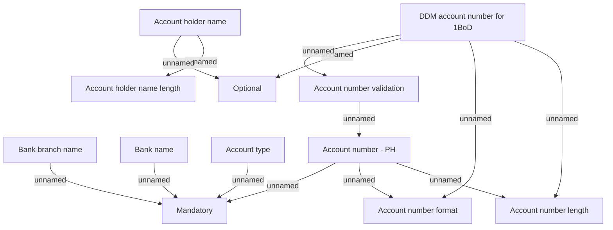

# Validation rules PH

```mermaid
graph TD
    DDM_account_number_for_1BoD["DDM account number for 1BoD"]
    Account_number_validation["Account number validation"]
    Optional["Optional"]
    Mandatory["Mandatory"]
    Bank_branch_name["Bank branch name"]
    Bank_name["Bank name"]
    Account_type["Account type"]
    Account_holder_name_length["Account holder name length"]
    Account_holder_name["Account holder name"]
    Account_number_format["Account number format"]
    Account_number_length["Account number length"]
    Account_number_PH["Account number - PH"]
    DDM_account_number_for_1BoD -->|unnamed| Account_number_length
    Account_number_PH -->|unnamed| Account_number_length
    DDM_account_number_for_1BoD -->|unnamed| Account_number_format
    Account_number_PH -->|unnamed| Account_number_format
    Account_holder_name -->|unnamed| Account_holder_name_length
    Bank_branch_name -->|unnamed| Mandatory
    Account_number_PH -->|unnamed| Mandatory
    Account_type -->|unnamed| Mandatory
    Bank_name -->|unnamed| Mandatory
    DDM_account_number_for_1BoD -->|unnamed| Optional
    Account_holder_name -->|unnamed| Optional
    DDM_account_number_for_1BoD -->|unnamed| Account_number_validation
    Account_number_validation -->|unnamed| Account_number_PH
```
