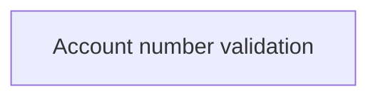

# Validation rules - Product

- **Diagram Type**: Custom
- **Package**: HomerSelect/BSL/Analysis Model/COMMON for BSL/Bank Account Management/Validation rules/Product
- **Diagram ID**: 154613
- **Elements**: 1
- **Connectors**: 0

