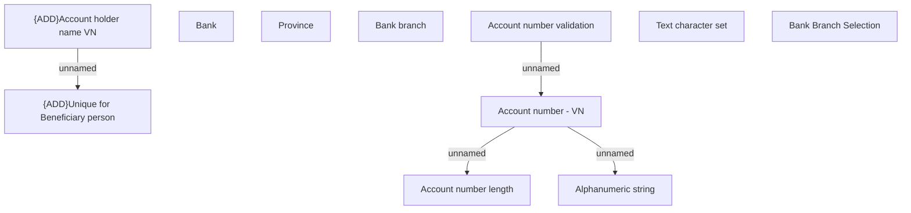

# Validation rules VN

```mermaid
graph TD
    ADD_Unique_for_Beneficiary_person["{ADD}Unique for Beneficiary person"]
    ADD_Account_holder_name_VN["{ADD}Account holder name VN"]
    Bank["Bank"]
    Province["Province"]
    Bank_branch["Bank branch"]
    Alphanumeric_string["Alphanumeric string"]
    Account_number_validation["Account number validation"]
    Text_character_set["Text character set"]
    Account_number_VN["Account number - VN"]
    Account_number_length["Account number length"]
    Bank_Branch_Selection["Bank Branch Selection"]
    ADD_Account_holder_name_VN -->|unnamed| ADD_Unique_for_Beneficiary_person
    Account_number_VN -->|unnamed| Account_number_length
    Account_number_validation -->|unnamed| Account_number_VN
    Account_number_VN -->|unnamed| Alphanumeric_string
```
