# Access Rights

- **Diagram Type**: Custom
- **Package**: HomerSelect/BSL/Analysis Model/COMMON for BSL/Bank Management/Bank management/Access Rights
- **Diagram ID**: 67007
- **Elements**: 16
- **Connectors**: 8

```mermaid
graph TD
    n_00_150_Find_bank_branch["00.150 Find bank branch"]
    n_00_140_Show_bank_branch_detail["00.140 Show bank branch detail"]
    MOD_00_130_Update_bank_branch["{MOD} 00.130 Update bank branch"]
    MOD_00_120_Create_bank_branch["{MOD} 00.120 Create bank branch"]
    n_00_110_Find_bank["00.110 Find bank"]
    n_00_180_Show_bank_detail["00.180 Show bank detail"]
    MOD_00_170_Update_bank["{MOD} 00.170 Update bank"]
    MOD_00_160_Create_bank["{MOD} 00.160 Create bank"]
    n_00_150_Find_bank_branch["00.150 Find bank branch"]
    n_00_140_Show_bank_branch["00.140 Show bank branch"]
    n_00_130_Update_bank_branch["00.130 Update bank branch"]
    n_00_120_Create_bank_branch["00.120 Create bank branch"]
    n_00_110_Find_bank["00.110 Find bank"]
    n_00_180_Show_bank["00.180 Show bank"]
    n_00_170_Update_bank["00.170 Update bank"]
    n_00_160_Create_bank["00.160 Create bank"]
    MOD_00_120_Create_bank_branch -->|unnamed| n_00_120_Create_bank_branch
    MOD_00_160_Create_bank -->|unnamed| n_00_160_Create_bank
    MOD_00_130_Update_bank_branch -->|unnamed| n_00_130_Update_bank_branch
    n_00_110_Find_bank -->|unnamed| n_00_110_Find_bank
    MOD_00_170_Update_bank -->|unnamed| n_00_170_Update_bank
    n_00_140_Show_bank_branch_detail -->|unnamed| n_00_140_Show_bank_branch
    n_00_150_Find_bank_branch -->|unnamed| n_00_150_Find_bank_branch
    n_00_180_Show_bank_detail -->|unnamed| n_00_180_Show_bank
```

