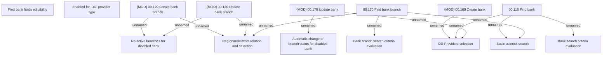

# Business rules

```mermaid
graph TD
    Find_bank_fields_editability["Find bank fields editability"]
    Enabled_for_DD_provider_type["Enabled for 'DD' provider type"]
    DD_Providers_selection["DD Providers selection"]
    Bank_search_criteria_evaluation["Bank search criteria evaluation"]
    Basic_asterisk_search["Basic asterisk search"]
    MOD_00_130_Update_bank_branch["{MOD} 00.130 Update bank branch"]
    MOD_00_120_Create_bank_branch["{MOD} 00.120 Create bank branch"]
    MOD_00_170_Update_bank["{MOD} 00.170 Update bank"]
    Region_District_relation_and_selection["RegionandDistrict relation and selection"]
    Bank_branch_search_criteria_evaluation["Bank branch search criteria evaluation"]
    n_00_150_Find_bank_branch["00.150 Find bank branch"]
    n_00_110_Find_bank["00.110 Find bank"]
    MOD_00_160_Create_bank["{MOD} 00.160 Create bank"]
    Automatic_change_of_branch_status_for_disabled_bank["Automatic change of branch status for disabled bank"]
    No_active_branches_for_disabled_bank["No active branches for disabled bank"]
    MOD_00_120_Create_bank_branch -->|unnamed| No_active_branches_for_disabled_bank
    MOD_00_120_Create_bank_branch -->|unnamed| Region_District_relation_and_selection
    MOD_00_160_Create_bank -->|unnamed| DD_Providers_selection
    MOD_00_130_Update_bank_branch -->|unnamed| Region_District_relation_and_selection
    MOD_00_130_Update_bank_branch -->|unnamed| No_active_branches_for_disabled_bank
    n_00_110_Find_bank -->|unnamed| Basic_asterisk_search
    n_00_110_Find_bank -->|unnamed| Bank_search_criteria_evaluation
    n_00_110_Find_bank -->|unnamed| DD_Providers_selection
    MOD_00_170_Update_bank -->|unnamed| Automatic_change_of_branch_status_for_disabled_bank
    MOD_00_170_Update_bank -->|unnamed| DD_Providers_selection
    n_00_150_Find_bank_branch -->|unnamed| Region_District_relation_and_selection
    n_00_150_Find_bank_branch -->|unnamed| Bank_branch_search_criteria_evaluation
    n_00_150_Find_bank_branch -->|unnamed| Basic_asterisk_search
```
