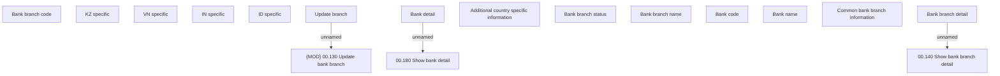

# Bank branch detail

```mermaid
graph TD
    Bank_branch_code["Bank branch code"]
    KZ_specific["KZ specific"]
    VN_specific["VN specific"]
    IN_specific["IN specific"]
    ID_specific["ID specific"]
    n_00_180_Show_bank_detail["00.180 Show bank detail"]
    MOD_00_130_Update_bank_branch["{MOD} 00.130 Update bank branch"]
    Update_branch["Update branch"]
    n_00_140_Show_bank_branch_detail["00.140 Show bank branch detail"]
    Bank_detail["Bank detail"]
    Additional_country_specific_information["Additional country specific information"]
    Bank_branch_status["Bank branch status"]
    Bank_branch_name["Bank branch name"]
    Bank_code["Bank code"]
    Bank_name["Bank name"]
    Common_bank_branch_information["Common bank branch information"]
    Bank_branch_detail["Bank branch detail"]
    Bank_branch_detail -->|unnamed| n_00_140_Show_bank_branch_detail
    Update_branch -->|unnamed| MOD_00_130_Update_bank_branch
    Bank_detail -->|unnamed| n_00_180_Show_bank_detail
```
