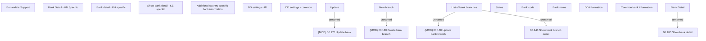

# Bank detail

```mermaid
graph TD
    E_mandate_Support["E-mandate Support"]
    Bank_Detail_VN_Specific["Bank Detail - VN Specific"]
    Bank_detail_PH_specific["Bank detail - PH specific"]
    Show_bank_detail_KZ_specific["Show bank detail - KZ specific"]
    Additional_country_specific_bank_information["Additional country specific bank information"]
    DD_settings_ID["DD settings - ID"]
    DD_settings_common["DD settings - common"]
    MOD_00_170_Update_bank["{MOD} 00.170 Update bank"]
    Update["Update"]
    n_00_180_Show_bank_detail["00.180 Show bank detail"]
    n_00_140_Show_bank_branch_detail["00.140 Show bank branch detail"]
    MOD_00_130_Update_bank_branch["{MOD} 00.130 Update bank branch"]
    MOD_00_120_Create_bank_branch["{MOD} 00.120 Create bank branch"]
    New_branch["New branch"]
    List_of_bank_branches["List of bank branches"]
    Status["Status"]
    Bank_code["Bank code"]
    Bank_name["Bank name"]
    DD_information["DD information"]
    Common_bank_information["Common bank information"]
    Bank_Detail["Bank Detail"]
    New_branch -->|unnamed| MOD_00_120_Create_bank_branch
    List_of_bank_branches -->|unnamed| MOD_00_130_Update_bank_branch
    List_of_bank_branches -->|unnamed| n_00_140_Show_bank_branch_detail
    Bank_Detail -->|unnamed| n_00_180_Show_bank_detail
    Update -->|unnamed| MOD_00_170_Update_bank
```
