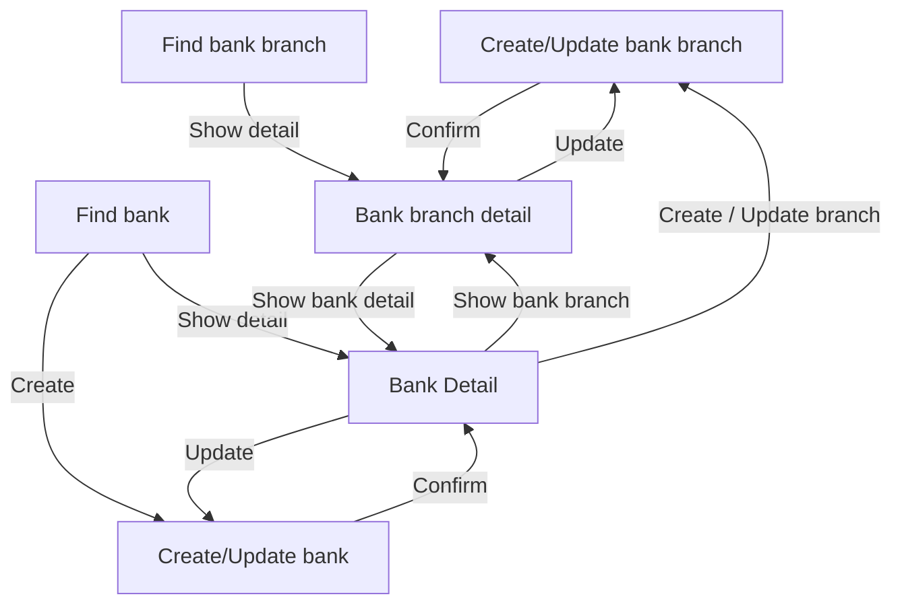

# Bank management navigation

- **Diagram Type**: Custom
- **Package**: HomerSelect/BSL/Analysis Model/COMMON for BSL/Bank Management/Bank management/User Interface
- **Diagram ID**: 152615
- **Elements**: 6
- **Connectors**: 10

