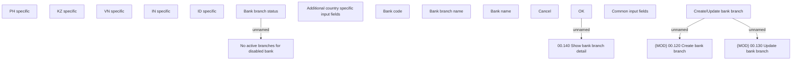

# Create/Update bank branch

```mermaid
graph TD
    PH_specific["PH specific"]
    KZ_specific["KZ specific"]
    VN_specific["VN specific"]
    No_active_branches_for_disabled_bank["No active branches for disabled bank"]
    IN_specific["IN specific"]
    ID_specific["ID specific"]
    Bank_branch_status["Bank branch status"]
    n_00_140_Show_bank_branch_detail["00.140 Show bank branch detail"]
    Additional_country_specific_input_fields["Additional country specific input fields"]
    MOD_00_130_Update_bank_branch["{MOD} 00.130 Update bank branch"]
    Bank_code["Bank code"]
    MOD_00_120_Create_bank_branch["{MOD} 00.120 Create bank branch"]
    Bank_branch_name["Bank branch name"]
    Bank_name["Bank name"]
    Cancel["Cancel"]
    OK["OK"]
    Common_input_fields["Common input fields"]
    Create_Update_bank_branch["Create/Update bank branch"]
    Create_Update_bank_branch -->|unnamed| MOD_00_120_Create_bank_branch
    Create_Update_bank_branch -->|unnamed| MOD_00_130_Update_bank_branch
    OK -->|unnamed| n_00_140_Show_bank_branch_detail
    Bank_branch_status -->|unnamed| No_active_branches_for_disabled_bank
```
