# Create/Update bank

- **Diagram Type**: Custom
- **Package**: HomerSelect/BSL/Analysis Model/COMMON for BSL/Bank Management/Bank management/User Interface
- **Diagram ID**: 152609
- **Elements**: 21
- **Connectors**: 3

```mermaid
graph TD
    DEL_Additional_bank_data_IN_specific["{DEL}Additional bank data - IN specific"]
    DEL_Bank_additional_data["{DEL}Bank additional data"]
    DEL_Bank_additional_data["{DEL}Bank additional data"]
    PH_specific["PH specific"]
    IN_specific["IN specific"]
    ID_specific["ID specific"]
    VN_specific["VN specific"]
    KZ_specific["KZ specific"]
    Additional_country_specific_input_fields["Additional country specific input fields"]
    DD_settings_ID["DD settings - ID"]
    DD_settings_Common["DD settings - Common"]
    n_00_180_Show_bank_detail["00.180 Show bank detail"]
    Status["Status"]
    MOD_00_170_Update_bank["{MOD} 00.170 Update bank"]
    MOD_00_160_Create_bank["{MOD} 00.160 Create bank"]
    Bank_name["Bank name"]
    OK["OK"]
    Cancel["Cancel"]
    DD_settings["DD settings"]
    Common_input_fields["Common input fields"]
    Create_Update_bank["Create/Update bank"]
    Create_Update_bank -->|unnamed| MOD_00_160_Create_bank
    Create_Update_bank -->|unnamed| MOD_00_170_Update_bank
    OK -->|unnamed| n_00_180_Show_bank_detail
```

