# Find bank branch

- **Diagram Type**: Custom
- **Package**: HomerSelect/BSL/Analysis Model/COMMON for BSL/Bank Management/Bank management/User Interface
- **Diagram ID**: 152613
- **Elements**: 17
- **Connectors**: 2

```mermaid
graph TD
    VN_specific["VN specific"]
    KZ_specific["KZ specific"]
    ID_specific["ID specific"]
    IN_specific["IN specific"]
    Country_specific_search_fields["Country specific search fields"]
    n_00_140_Show_bank_branch_detail["00.140 Show bank branch detail"]
    Bank_branch_search_result["Bank branch search result"]
    Search["Search"]
    Reset["Reset"]
    Bank_branch_status["Bank branch status"]
    Primary_bank_branch_code["Primary bank branch code"]
    Bank_branch_name["Bank branch name"]
    Bank_status["Bank status"]
    Bank_code["Bank code"]
    Bank_name["Bank name"]
    n_00_150_Find_bank_branch["00.150 Find bank branch"]
    Find_bank_branch["Find bank branch"]
    Find_bank_branch -->|unnamed| n_00_150_Find_bank_branch
    Bank_branch_search_result -->|unnamed| n_00_140_Show_bank_branch_detail
```

