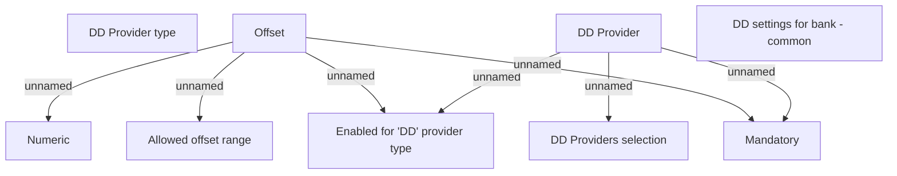

# Bank DD settings - Common

```mermaid
graph TD
    Enabled_for_DD_provider_type["Enabled for 'DD' provider type"]
    DD_Provider_type["DD Provider type"]
    Allowed_offset_range["Allowed offset range"]
    Numeric["Numeric"]
    Offset["Offset"]
    DD_Provider["DD Provider"]
    DD_settings_for_bank_common["DD settings for bank - common"]
    DD_Providers_selection["DD Providers selection"]
    Mandatory["Mandatory"]
    DD_Provider -->|unnamed| DD_Providers_selection
    DD_Provider -->|unnamed| Mandatory
    DD_Provider -->|unnamed| Enabled_for_DD_provider_type
    Offset -->|unnamed| Enabled_for_DD_provider_type
    Offset -->|unnamed| Numeric
    Offset -->|unnamed| Allowed_offset_range
    Offset -->|unnamed| Mandatory
```
