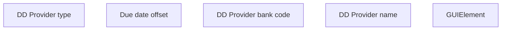

# Bank DD settings detail - Common

```mermaid
graph TD
    DD_Provider_type["DD Provider type"]
    Due_date_offset["Due date offset"]
    DD_Provider_bank_code["DD Provider bank code"]
    DD_Provider_name["DD Provider name"]
    el_865777["GUIElement"]
```
