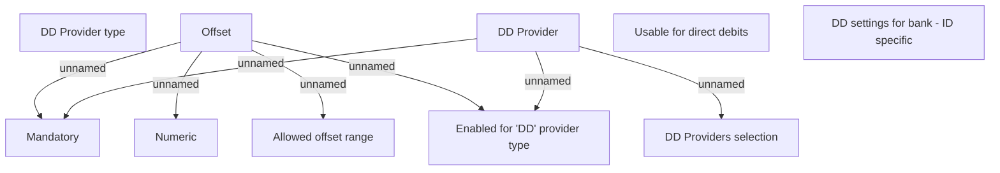

# Bank DD settings - ID specific

- **Diagram Type**: Custom
- **Package**: HomerSelect/BSL/Analysis Model/COMMON for BSL/Bank Management/Bank management/User Interface/ID
- **Diagram ID**: 152605
- **Elements**: 10
- **Connectors**: 7

