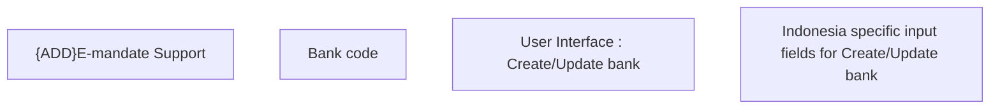

# Create/Update bank - ID specific

```mermaid
graph TD
    ADD_E_mandate_Support["{ADD}E-mandate Support"]
    Bank_code["Bank code"]
    User_Interface_Create_Update_bank["User Interface : Create/Update bank"]
    Indonesia_specific_input_fields_for_Create_Update_bank["Indonesia specific input fields for Create/Update bank"]
```
