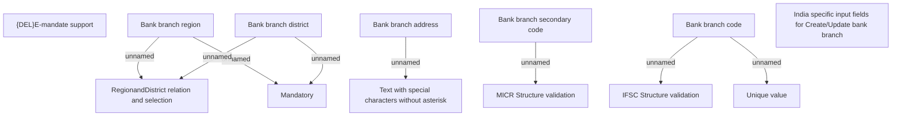

# Create/Update bank branch - IN specific

```mermaid
graph TD
    DEL_E_mandate_support["{DEL}E-mandate support"]
    Mandatory["Mandatory"]
    Bank_branch_district["Bank branch district"]
    Bank_branch_region["Bank branch region"]
    Region_District_relation_and_selection["RegionandDistrict relation and selection"]
    Unique_value["Unique value"]
    Text_with_special_characters_without_asterisk["Text with special characters without asterisk"]
    MICR_Structure_validation["MICR Structure validation"]
    IFSC_Structure_validation["IFSC Structure validation"]
    Bank_branch_address["Bank branch address"]
    Bank_branch_secondary_code["Bank branch secondary code"]
    Bank_branch_code["Bank branch code"]
    India_specific_input_fields_for_Create_Update_bank_branch["India specific input fields for Create/Update bank branch"]
    Bank_branch_code -->|unnamed| IFSC_Structure_validation
    Bank_branch_code -->|unnamed| Unique_value
    Bank_branch_secondary_code -->|unnamed| MICR_Structure_validation
    Bank_branch_address -->|unnamed| Text_with_special_characters_without_asterisk
    Bank_branch_region -->|unnamed| Region_District_relation_and_selection
    Bank_branch_region -->|unnamed| Mandatory
    Bank_branch_district -->|unnamed| Region_District_relation_and_selection
    Bank_branch_district -->|unnamed| Mandatory
```
