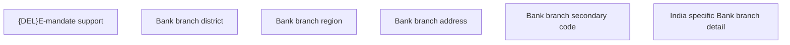

# Show bank branch detail - IN specific

- **Diagram Type**: Custom
- **Package**: HomerSelect/BSL/Analysis Model/COMMON for BSL/Bank Management/Bank management/User Interface/IN
- **Diagram ID**: 107551
- **Elements**: 6
- **Connectors**: 0

