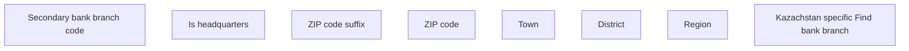

# Find bank branch - KZ specific

```mermaid
graph TD
    Secondary_bank_branch_code["Secondary bank branch code"]
    Is_headquarters["Is headquarters"]
    ZIP_code_suffix["ZIP code suffix"]
    ZIP_code["ZIP code"]
    Town["Town"]
    District["District"]
    Region["Region"]
    Kazachstan_specific_Find_bank_branch["Kazachstan specific Find bank branch"]
```
