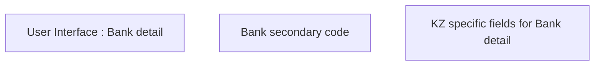

# Show bank detail - KZ specific

- **Diagram Type**: Custom
- **Package**: HomerSelect/BSL/Analysis Model/COMMON for BSL/Bank Management/Bank management/User Interface/KZ
- **Diagram ID**: 82410
- **Elements**: 3
- **Connectors**: 0

