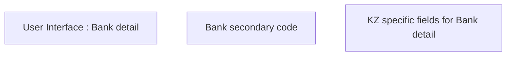

# Show bank detail - KZ specific

```mermaid
graph TD
    User_Interface_Bank_detail["User Interface : Bank detail"]
    Bank_secondary_code["Bank secondary code"]
    KZ_specific_fields_for_Bank_detail["KZ specific fields for Bank detail"]
```
